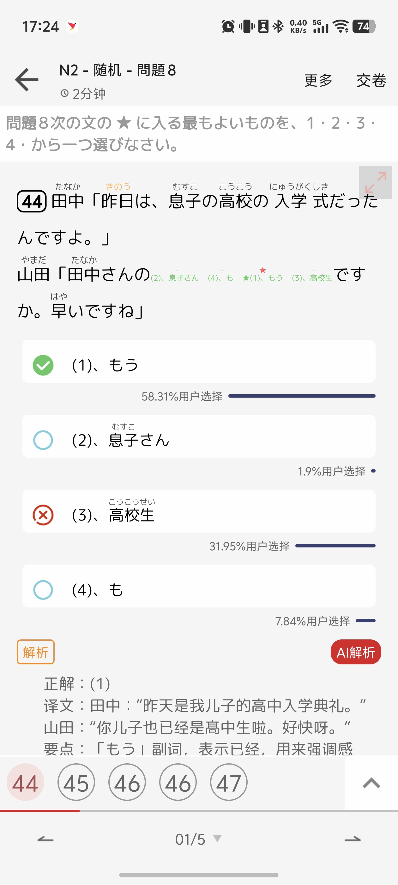
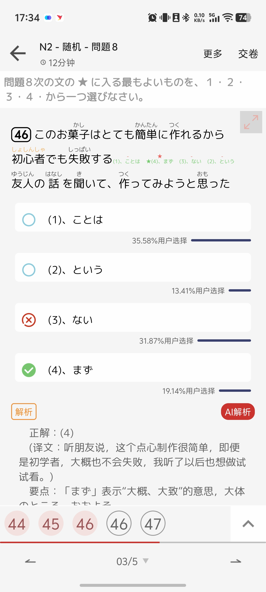
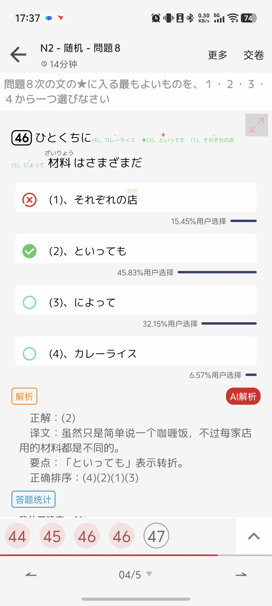
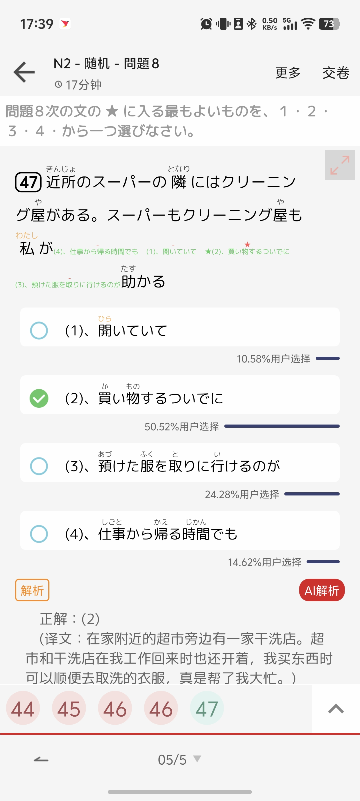

# 2026-05-11 N2 文の組み立て错题 4 题

标签: `#错题` `#文法` `#文の組み立て` `#jlpt-n2`

## 基本信息

| 项目 | 内容 |
|---|---|
| 日期 | 2026-05-11 |
| 级别 | N2 |
| 题型 | 文の組み立て |
| 题数 | 4 |
| 截图目录 | [mistakes/assets/2026-05-11](../../assets/2026-05-11) |

## 截图归档

- 
- 
- 
- 

## 错题总览

| 题号 | 题型 | 你的答案 | 正解 | 高频考点 | 复习入口 |
|---|---|---|---|---|---|
| 1 | 文の組み立て | 3 | 1 | `NももうNです` | [文の組み立て](../../../grammar/n2-sentence-ordering-patterns.md) |
| 2 | 文の組み立て | 3 | 4 | `VることはまずないというN` | [文の組み立て](../../../grammar/n2-sentence-ordering-patterns.md) |
| 3 | 文の組み立て | 1 | 2 | `ひとくちにNといっても` | [文の組み立て](../../../grammar/n2-sentence-ordering-patterns.md) |
| 4 | 文の組み立て | 2 | 2 | `時間でも開いていて...のが助かる` | [文の組み立て](../../../grammar/n2-sentence-ordering-patterns.md) |

## 复习入口

- 文法: [N2 文の組み立て：修饰关系・固定结构・句子骨架](../../../grammar/n2-sentence-ordering-patterns.md)
- 語彙: なし
- 漢字: なし
- 読解: なし
- 聴解: なし

## 错题解析

整理规则:

- 先完整保留题干和全部选项，不要加工、概括或改写原题。
- 排序题必须保留原来的 `＿＿ ＿＿ ★ ＿＿` 形式、选项、你的答案、正解、正确顺序、★答案和还原过程。

### 1. 文の組み立て

#### 原题完整记录（不要加工）

- 题干: 田中「昨日は、息子の高校の入学式だったんですよ。」山田「田中さんの＿＿ ＿＿ ★ ＿＿ですか。早いですね」
- 空格形式: ＿＿ ＿＿ ★ ＿＿

#### 原题排序形式

> ＿＿ ＿＿ ★ ＿＿

#### 选项

1. もう
2. 息子さん
3. 高校生
4. も

#### 你的答案 / 正解

- 你的答案: 3. 高校生
- 正解: 1. もう

#### 正确顺序

- 顺序: 2 → 4 → 1 → 3
- ★答案: 1. もう

#### 还原过程

- `田中さんの息子さん` 先形成名词短语。
- `息子さんも` 表示“您儿子也……”。
- `もう高校生ですか` 表示“已经是高中生了吗”。

#### 完整句

> 山田「田中さんの息子さんももう高校生ですか。早いですね」

#### 中文翻译

- 山田: “田中先生/女士，您儿子也已经是高中生了吗？真快啊。”

#### 整句翻译

> 田中: “昨天是我儿子的高中入学典礼。”山田: “您儿子也已经是高中生了吗？真快啊。”

#### 整句拆解

| 片段 | 意思 | 说明 |
|---|---|---|
| 田中さんの息子さんも | 田中先生/女士的儿子也 | `も` 附在名词后 |
| もう高校生ですか | 已经是高中生了吗 | `もう` 修饰后面的状态 |

#### 高频考点

- `NももうNです`，`もう` 要放在谓语名词前。

#### 下次怎么判断

- 先组 `田中さんの息子さん`，再加 `も`，最后接 `もう高校生ですか`。

### 2. 文の組み立て

#### 原题完整记录（不要加工）

- 题干: このお菓子はとても簡単に作れるから初心者でも失敗する＿＿ ＿＿ ★ ＿＿友人の話を聞いて、作ってみようと思った。
- 空格形式: ＿＿ ＿＿ ★ ＿＿

#### 原题排序形式

> ＿＿ ＿＿ ★ ＿＿

#### 选项

1. ことは
2. という
3. ない
4. まず

#### 你的答案 / 正解

- 你的答案: 3. ない
- 正解: 4. まず

#### 正确顺序

- 顺序: 1 → 4 → 3 → 2
- ★答案: 4. まず

#### 还原过程

- `失敗することは` 把前面的动作名词化，作为话题。
- `まずない` 表示“基本没有”。
- `という友人の話` 表示“朋友说的那番话/说法”。

#### 完整句

> このお菓子はとても簡単に作れるから初心者でも失敗することはまずないという友人の話を聞いて、作ってみようと思った。

#### 中文翻译

- 听朋友说“这个点心做起来很简单，即使是初学者也基本不会失败”，于是我想试着做做看。

#### 整句翻译

> 听了朋友说这种点心很容易做、初学者也基本不会失败的话后，我想试着做做看。

#### 整句拆解

| 片段 | 意思 | 说明 |
|---|---|---|
| 失敗することは | 失败这件事 | 动词普通形 + こと |
| まずない | 基本没有 | 判断副词 + 否定 |
| という友人の話 | 朋友说的内容 | `という` 连接引用内容和名词 |

#### 高频考点

- `VることはまずないというN`。

#### 下次怎么判断

- 看到后面有 `友人の話`，先找 `という`；`という` 前面要是完整内容。

### 3. 文の組み立て

#### 原题完整记录（不要加工）

- 题干: ひとくちに＿＿ ★ ＿＿ ＿＿材料はさまざまだ
- 空格形式: ＿＿ ★ ＿＿ ＿＿

#### 原题排序形式

> ＿＿ ★ ＿＿ ＿＿

#### 选项

1. それぞれの店
2. といっても
3. によって
4. カレーライス

#### 你的答案 / 正解

- 你的答案: 1. それぞれの店
- 正解: 2. といっても

#### 正确顺序

- 顺序: 4 → 2 → 1 → 3
- ★答案: 2. といっても

#### 还原过程

- `ひとくちにカレーライスといっても` 是固定结构，表示“虽说都叫咖喱饭”。
- `それぞれの店によって` 表示“根据每家店”。
- 后面接 `材料はさまざまだ`。

#### 完整句

> ひとくちにカレーライスといっても、それぞれの店によって材料はさまざまだ。

#### 中文翻译

- 虽说都叫咖喱饭，但根据每家店不同，材料也各式各样。

#### 整句翻译

> 虽然一句话说是咖喱饭，不过每家店用的材料各不相同。

#### 整句拆解

| 片段 | 意思 | 说明 |
|---|---|---|
| ひとくちにNといっても | 虽说统称为N | 固定让步结构 |
| それぞれの店によって | 根据每家店 | `Nによって` 表差异依据 |
| 材料はさまざまだ | 材料各式各样 | 结论 |

#### 高频考点

- `ひとくちにNといっても、Nによって...さまざまだ`。

#### 下次怎么判断

- `ひとくちに` 后面优先找名词，再接 `といっても`。

### 4. 文の組み立て

#### 原题完整记录（不要加工）

- 题干: 近所のスーパーの隣にはクリーニング屋がある。スーパーもクリーニング屋も私が＿＿ ＿＿ ★ ＿＿助かる
- 空格形式: ＿＿ ＿＿ ★ ＿＿

#### 原题排序形式

> ＿＿ ＿＿ ★ ＿＿

#### 选项

1. 開いていて
2. 買い物するついでに
3. 預けた服を取りに行けるのが
4. 仕事から帰る時間でも

#### 你的答案 / 正解

- 你的答案: 2. 買い物するついでに
- 正解: 2. 買い物するついでに

#### 正确顺序

- 顺序: 4 → 1 → 2 → 3
- ★答案: 2. 買い物するついでに

#### 还原过程

- `私が仕事から帰る時間でも` 表示“即使在我下班回来的时间”。
- `開いていて` 连接后续便利之处。
- `買い物するついでに預けた服を取りに行けるのが助かる` 是“能顺便去取衣服这一点很帮忙”。

#### 完整句

> スーパーもクリーニング屋も私が仕事から帰る時間でも開いていて、買い物するついでに預けた服を取りに行けるのが助かる。

#### 中文翻译

- 超市和干洗店在我下班回来的时间也还开着，我能在买东西时顺便去取寄放的衣服，这点很帮忙。

#### 整句翻译

> 家附近的超市旁边有一家干洗店。超市和干洗店在我下班回来的时间也开着，所以能买东西时顺便取衣服，真是帮了大忙。

#### 整句拆解

| 片段 | 意思 | 说明 |
|---|---|---|
| 仕事から帰る時間でも | 即使是下班回来的时间 | `でも` 表让步 |
| 開いていて | 开着，而且 | て形连接 |
| 買い物するついでに | 买东西顺便 | `ついでに` 表顺便 |
| 取りに行けるのが助かる | 能去取这一点很帮忙 | `のが助かる` |

#### 高频考点

- `Vるついでに`、`Vていて、...のが助かる`。

#### 下次怎么判断

- 先找让步时间 `時間でも`，再接状态 `開いていて`，最后接具体便利动作。

## 迷你复习题

### 問題

1. 田中さんの息子さん（　）もう高校生ですか。
2. 初心者でも失敗することは（　）ないという話を聞いた。
3. ひとくちにラーメン（　）、店によって味は全然違う。
4. 買い物する（　）クリーニング屋に寄った。

### 答え

1. も
2. まず
3. といっても
4. ついでに

## 下次避免方法

- 排序题先找固定结构: `ひとくちにNといっても`、`VることはまずないというN`。
- 再确认 ★ 是第几个空，不要只还原完整句后忘记数星号位置。
